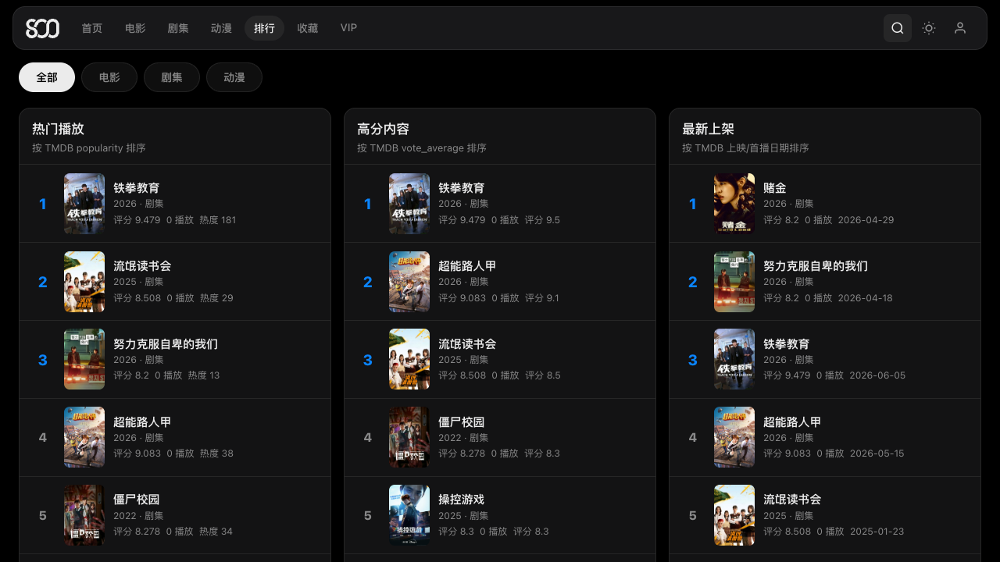
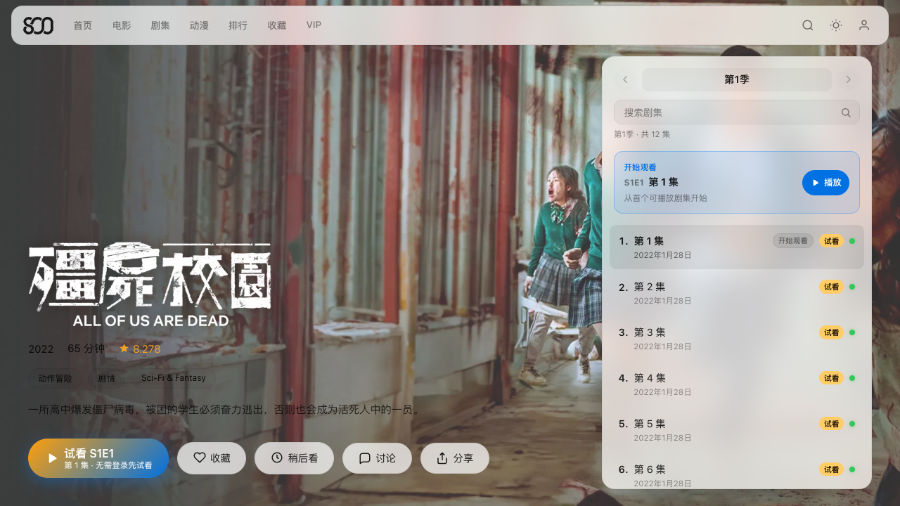
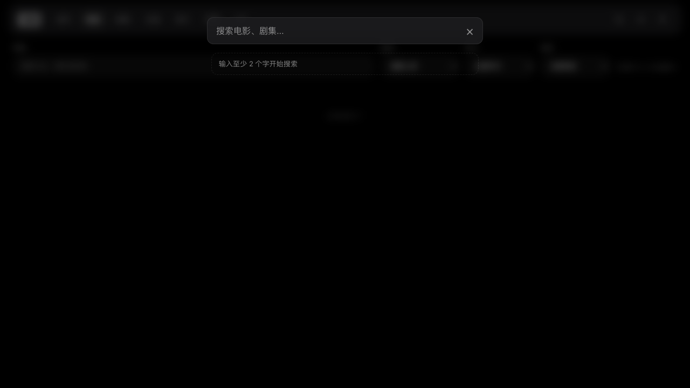

# 800-web

800影视 **Web 客户端** — 浏览器打开即可找片、看片、续播。生产站点：[guangying.org](https://guangying.org)

零框架 SPA，部署在 Cloudflare Workers；播放器通过 CDN 按需加载。

## 在线体验

👉 **https://guangying.org**

电脑、iPad、手机浏览器均可使用；支持添加到主屏幕（PWA）。

## 界面预览

### 首页推荐


运营 Hero + 个性化推荐行，登录后可从首页继续观看。

### 片库与排行




按分类浏览，或用排行榜快速「抄作业」。

### 详情页



海报、评分、简介、选集一屏展示；部分集数支持试看。

### 搜索



任意页面唤起搜索，输入即出结果。

### 暗色主题


一键切换明暗主题，夜间追剧更友好。

## 主要能力

- 首页推荐、分类片库、搜索、详情、独立播放器页
- HLS 自适应播放（gy-player）、字幕、倍速、画中画、弹幕
- 登录同步：历史、收藏、稍后看、续播进度、VIP 权益
- Service Worker 缓存、View Transitions、响应式布局
- Cloudflare Workers 部署，API 通过 Service Binding 连接 `800-api-worker`

## 本地开发

```bash
node dev-server.mjs
# 默认 http://127.0.0.1:8787
```

语法检查：

```bash
find src -name "*.js" -print0 | xargs -0 -n1 node --check
node --test test/*.test.mjs
```

## 部署

```bash
node scripts/sync-static-version.mjs
npx wrangler deploy
```

推送 `main` 分支后，GitHub Actions 会自动验证并部署（需配置 `CLOUDFLARE_API_TOKEN` / `CLOUDFLARE_ACCOUNT_ID`）。

## License

MIT
